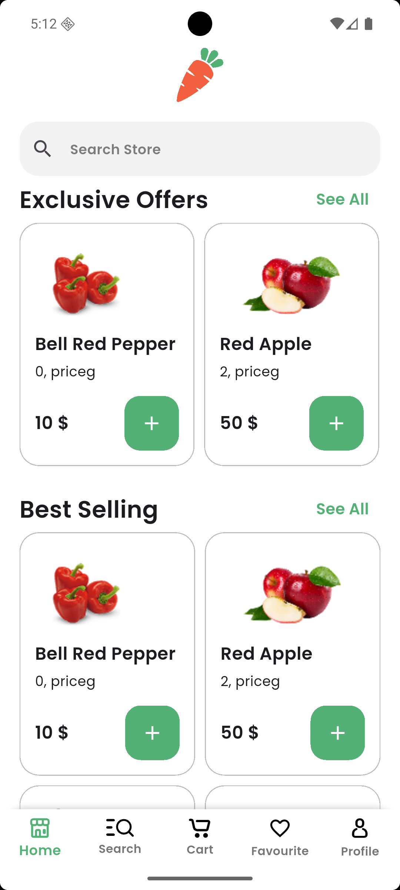
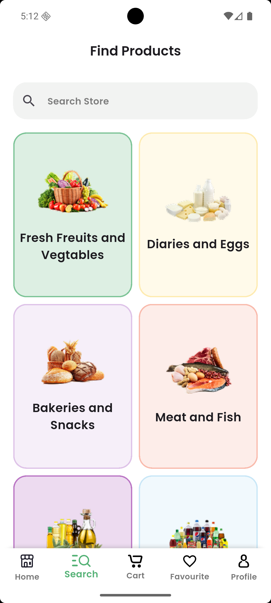
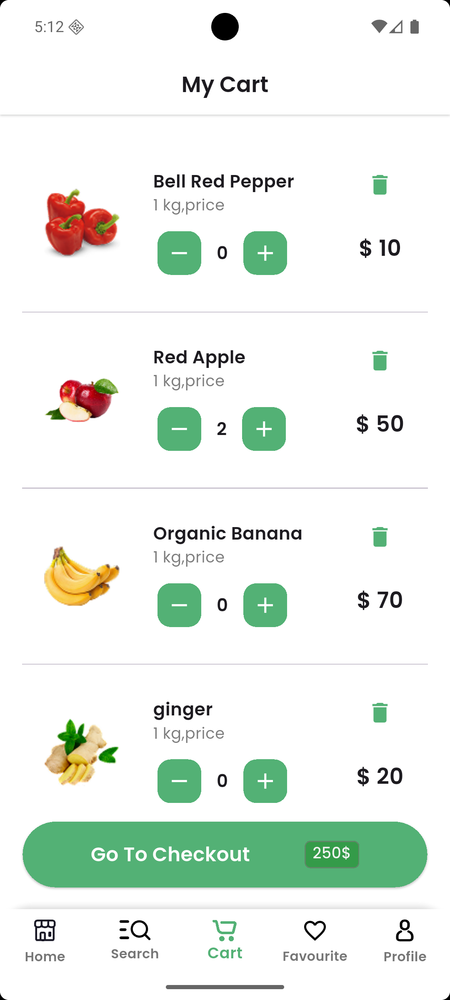
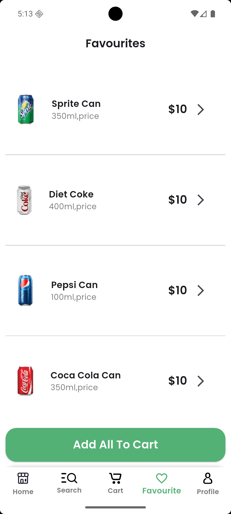
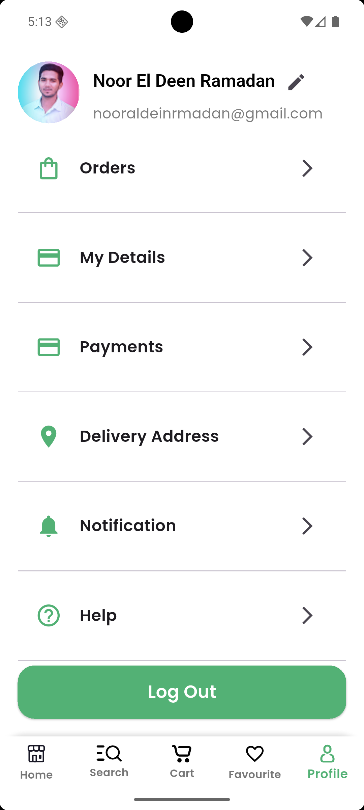

# 🍏 Nectar Online Grocery App


## 📌 Overview

**Nectar Online Grocery** is a modern Flutter-based mobile application that brings the grocery shopping experience online. The app allows users to explore categories, browse products, view details, manage their cart, and complete checkout—all from a smooth, user-friendly interface.

---

## ✨ Features

* 🛒 **Browse Products** by categories.
* 🔍 **Search functionality** for quick access.
* 📦 **Product details screen** with images and descriptions.
* 🛍️ **Add to cart & checkout process**.
* 🔄 **Seamless navigation** across multiple screens.
* 🎨 **Modern UI/UX** design with clean layouts.

---

## 📸 Screenshots

### 🔹 Navigation Flow (Main Screens)

### 🔹 Navigation Flow (Main Screens)

#### Main Screen
<p align="center">
  
</p>
<p align="center">
The Main Screen is the starting point of the app, showing featured products, categories, and quick access to other sections.
</p>

#### Search Screen
<p align="center">
  
</p>
<p align="center">
The Search Screen allows users to quickly find products by name, category, or filter options, ensuring efficient navigation.
</p>

#### Cart Screen
<p align="center">
  
</p>
<p align="center">
The Cart Screen displays all selected items, allows quantity adjustments, and provides a clear pathway to checkout.
</p>

#### Favourite Screen
<p align="center">
  
</p>
<p align="center">
The Favourite Screen shows all products marked by the user for easy access and future purchase.
</p>

#### Profile Screen
<p align="center">
  
</p>
<p align="center">
The Profile Screen allows users to view and edit account details, manage orders, and access app settings.
</p>

---

## 🚀 Getting Started

### 📂 Clone the repository

```bash
git clone https://github.com/NooR-El-Deen-Ramadan/nectar_olnine_grocery.git
cd nectar_olnine_grocery
```

### 📦 Install dependencies

```bash
flutter pub get
```

### ▶️ Run the app

```bash
flutter run
```

---

## 🛠️ Tech Stack

* **Framework:** Flutter
* **Language:** Dart
* **Architecture:** Clean, modular structure
* **Design:** Material UI + custom widgets

---


